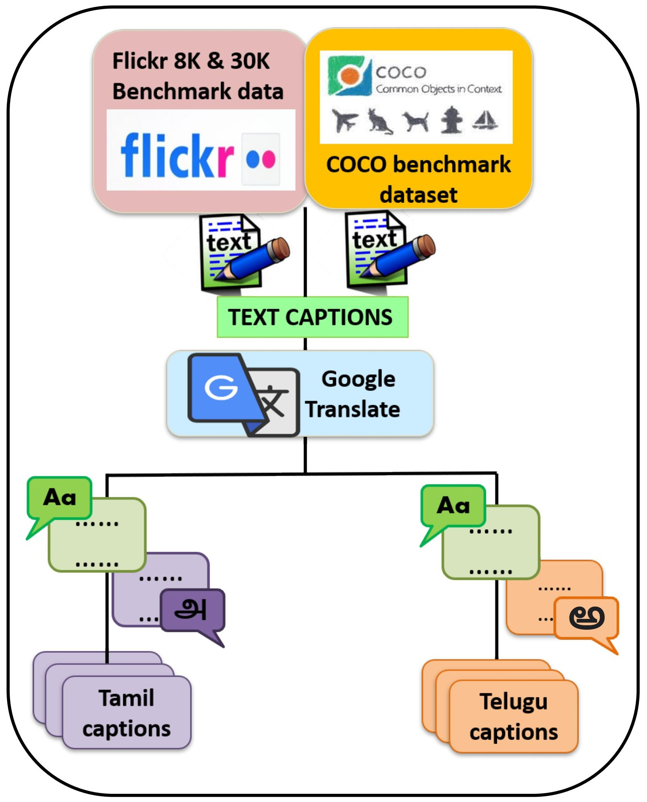
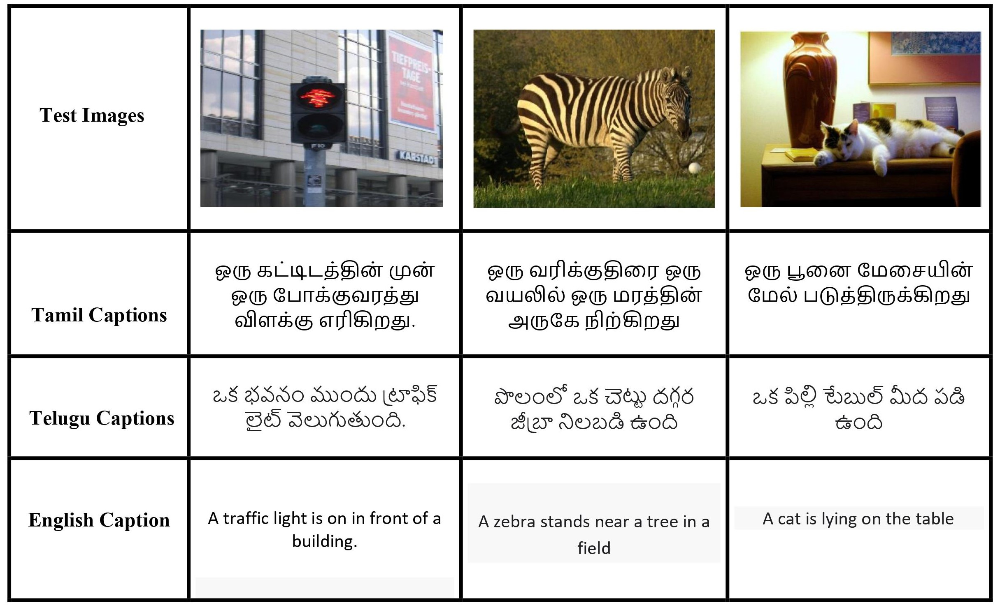

# Multilingual Image Captioning using Transformer Architecture

A Transformer-based multimodal deep learning project that generates image captions in **Tamil** and **Telugu** by combining CNN-based visual feature extraction with NLP-based sequence generation.

---

## Overview

This project focuses on multilingual image captioning for low-resource Indian languages using a Transformer encoder-decoder architecture. The system takes an input image, extracts visual features using pretrained CNN backbones, and generates context-aware captions in Tamil and Telugu.

The project explores how attention-based architectures improve visual-text alignment and sequence generation compared to traditional CNN-LSTM approaches.

> This repository contains the research paper and supporting architecture/result images.

---

# Architecture Overview

The model follows a multimodal Transformer pipeline:

```text
Input Image
   ↓
Image Preprocessing
   ↓
CNN Feature Extraction
   ↓
Visual Feature Projection
   ↓
Transformer Encoder
   ↓
Caption Preprocessing
   ↓
Word Embedding + Positional Encoding
   ↓
Transformer Decoder
   ↓
Softmax Prediction
   ↓
Generated Tamil/Telugu Caption
```

---

# Methodology

## Step 1: Image Preprocessing

Input images are processed before feature extraction.

### Preprocessing Steps

- Read image files
- Decode images into tensor format
- Resize images
- Normalize pixel values
- Convert images into fixed-size tensors

### CNN Input Sizes

| CNN Backbone | Input Size |
|---|---|
| InceptionV3 | 299 × 299 |
| ResNet50 | 224 × 224 |
| VGG16 | 224 × 224 |

---

## Step 2: Visual Feature Extraction

Preprocessed images are passed through pretrained CNN backbones such as:

- InceptionV3
- ResNet50
- VGG16

The final classification layer is removed, and the CNN is used only as a feature extractor.

```text
Input Image → CNN Backbone → Visual Feature Vector
```

The extracted features capture semantic information such as objects, scene context, and spatial relationships.

---

## Step 3: Visual Feature Projection

The extracted visual features are passed through a dense projection layer.

```text
Visual Features → Dense Projection → Transformer Embedding Space
```

This aligns image features with text embeddings used inside the Transformer architecture.

---

## Step 4: Caption Preprocessing

Tamil and Telugu captions are cleaned and converted into numerical sequences.

### Caption Processing Pipeline

- Remove punctuation
- Remove noisy tokens
- Remove unwanted numeric values
- Add `<start>` and `<end>` tokens
- Tokenize captions
- Build vocabulary
- Convert words into integer sequences
- Pad sequences to fixed length

### Example

```text
Original Caption:
ஒரு நாய் புல்வெளியில் ஓடுகிறது

Processed Caption:
<start> ஒரு நாய் புல்வெளியில் ஓடுகிறது <end>
```

---

## Step 5: Word Embedding

Caption token IDs are passed through a trainable embedding layer.

```text
Token IDs → Word Embedding Layer → Caption Embeddings
```

This converts each word into a dense semantic vector representation.

---

## Step 6: Positional Encoding

Transformers process sequences in parallel, so positional encoding is added to preserve ordering information.

The architecture uses:

- 1D positional encoding for caption tokens
- 2D positional encoding for image features

```text
Embeddings + Positional Encoding
```

This helps the model understand both sequence order and spatial image structure.

---

## Step 7: Transformer Encoder

The Transformer encoder processes the projected visual embeddings.

### Encoder Components

- Multi-head self-attention
- Feed-forward networks
- Residual connections
- Layer normalization
- Dropout

```text
Projected Visual Features → Transformer Encoder
```

The encoder learns relationships between image regions and creates contextual image representations.

---

## Step 8: Transformer Decoder

The Transformer decoder generates captions word by word.

### Decoder Components

- Masked self-attention
- Encoder-decoder attention
- Feed-forward networks
- Residual connections
- Layer normalization

```text
Caption Embeddings → Transformer Decoder
```

Masked attention ensures the model only sees previously generated words while predicting the next word.

---

## Step 9: Visual-Text Attention

The decoder attends to the encoded image representation.

```text
Encoded Image Features + Caption Context → Attention Mechanism
```

This allows the model to focus on relevant image regions while generating each caption token.

---

## Step 10: Caption Generation

The final decoder output passes through a linear layer and softmax layer.

```text
Decoder Output → Softmax → Next Word Prediction
```

Caption generation continues until the `<end>` token is predicted.

---

# Transformer Components

| Component | Purpose |
|---|---|
| Multi-Head Attention | Learns visual-text relationships |
| Masked Self-Attention | Prevents future-word leakage |
| Encoder-Decoder Attention | Aligns image features with text |
| Positional Encoding | Preserves sequence and spatial order |
| Feed-Forward Network | Learns nonlinear feature transformations |
| Residual Connections | Improves gradient flow |
| Layer Normalization | Stabilizes training |

---

# Dataset

The project uses translated versions of standard image captioning datasets.

| Dataset | Description |
|---|---|
| Flickr8k | Small-scale benchmark dataset |
| Flickr30k | Larger and more diverse captioning dataset |
| MSCOCO | Large-scale dataset with complex visual scenes |

Each image contains multiple captions translated into Tamil and Telugu.

---

# Results

The best-performing architecture used **InceptionV3 + Transformer**.

## Tamil Caption Generation

| Dataset | BLEU-1 |
|---|---|
| Flickr8k | 65.16 |
| Flickr30k | 52.77 |
| MSCOCO | 51.08 |

## Telugu Caption Generation

| Dataset | BLEU-1 |
|---|---|
| Flickr8k | 66.79 |
| Flickr30k | 51.57 |
| MSCOCO | 50.36 |

The results show that Transformer-based attention improves multilingual caption generation and visual-text alignment.

---

# Visual Results

## Architecture Diagram

<p align="center">
  
</p>

## Training Results

<p align="center">
  
</p>

## Sample Caption Predictions

<p align="center">
  
</p>

# Skills Demonstrated

- Transformer architecture
- Natural Language Processing
- Multilingual text generation
- Image captioning
- Multi-head attention
- Sequence-to-sequence modeling
- CNN feature extraction
- Vision-language learning
- BLEU-based evaluation
- Multimodal deep learning

---


# License

This project is licensed under the MIT License.
